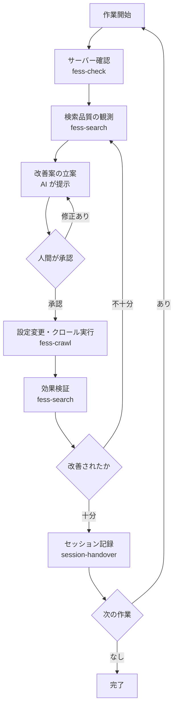

# プロジェクトの進め方

## フロー概要

## 詳細フロー

各フェーズの手順は対応する Skill に記述されている．

| フェーズ                     | Skill              |
| ---------------------------- | ------------------ |
| サーバー確認                 | `fess-check`       |
| 検索・効果検証               | `fess-search`      |
| クロール実行                 | `fess-crawl`       |
| セッション引き継ぎ（終了時） | `session-handover` |
| セッション引き継ぎ（開始時） | `session-override` |

## 進捗管理

- セッション記録: `sessions/` ディレクトリ
